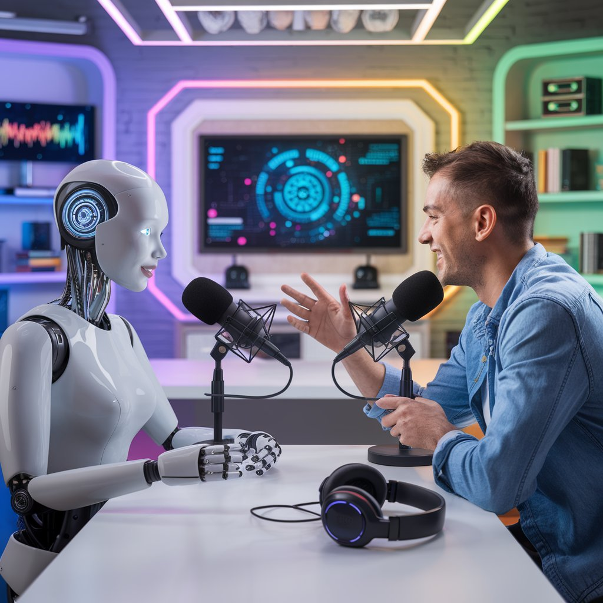

    

-------

# Projeto PODCAST Gerado por I.A.s

 > ℹ️ **NOTE:** Este é o repositório desenvolvido durante o bootcamp CAIXA - IA Generativa com Microsoft Copilot na plataforma da [DIO](https://dio.me)

Projeto com o objetivo de gerar um ebook digital com as facilidades das ferramentas de IA. todos os prompts seguem abaixo.

**Ouça o Podcast abaixo:**

<audio controls>
  <source src="./output/podcast_iai_negocios.mp3" type="audio/mpeg">
  Your browser does not support the audio element.
</audio>

**Música gerada pelo Suno AI:**

<audio controls>
  <source src="./output/musica_suno.mp3" type="audio/mpeg">
  Your browser does not support the audio element.
</audio>

## 💻 Tecnologias utilizadas no projeto

- [ChatGPT](https://chat.openai.com/) 
- [Ideogram](https://ideogram.ai/)
- [Suno AI](https://suno.com/)
- [CapCut](https://www.capcut.com/pt-br/)

## 🧠 Prompts

**ChatGPT：**

|   Ação   |Prompt                                                                                                                                                                                                                                                                         |
| :------: | ------------------------------------------------------------------------------------------------------------------------------------------------------------------------------------------------------------------------------------------------------------------------------ |
|  Podcast  | Você é um roteirista de podcast, e vamos criar um  roteiro de um podcast de tecnologia, focado em Inteligencia Artificial para pequenas e médias empresas cujo o nome é "IAí, Negócios!" e,  com o público alvo de empreendedores e gestores.    O formato do roteiro deve ser    [INTRODUÇÃO DO APRESENTADOR]   [INTRODUÇÃO DO ENTREVISTADO]   [PERGUNTA 1 DO APRESENTADOR]   [RESPOSTA 1 DO ENTREVISTADO]   [PERGUNTA 2 DO APRESENTADOR]   [RESPOSTA 2 DO ENTREVISTADO]   [FINALIZAÇÃO]    {REGRAS}    - no bloco [INTRODUÇÃO DO APRESENTADOR] substitua por uma introdução iguais as introduções dos vídeos do canal 'Jovens de Negócios', como se fossem escritos pelo Breno Perrucho  - no bloco [INTRODUÇÃO DO ENTREVISTADO] substitua por uma apresentação do apresentador apresentando da entrevistada que se chama BIA que é uma Inteligência Artificial, depois uma saudação da BIA.   - no bloco [PERGUNTA 1 DO APRESENTADOR] substitua por uma pergunta curiosa sobre Inteligência Artificial   - no bloco [RESPOSTA 1 DO ENTREVISTADO] substitua por uma resposta curiosa sobre Inteligência Artificial   - no bloco [PERGUNTA 2 DO APRESENTADOR] substitua por uma pergunta sobre ferramentas de IA para pequenas e médias empresas   - no bloco [RESPOSTA 1 DO ENTREVISTADO] substitua por uma resposta sobre ferramentas de IA para pequenas e médias empresas   - no bloco [FINALIZAÇÃO] substitua por uma despedida cool da BIA e do Apresentador com o final 'Eu sou Emerson e esse foi o IAí, Negócios! dessa semana'    - use termos de fácil explicação   - O podcast vai ser apresentado somente por uma pessoa, chamada Emerson   - O podcast vai ter uma entrevistada, chamada BIA   - O podcast deve ser curto    {REGRAS NEGATIVAS}    - Não use muitos termos técnicos   - Não ultrapasse 5 minutos de duração |

**Ideogram**：

|  Ação  | Prompt                                                                                 |
| :----: | -------------------------------------------------------------------------------------- |
| Capa   | In the center of the image, there is a dynamic scene depicting a podcast recording. A person, a man in his 30s with short, dark hair, is sitting across from a sleek, futuristic female robot. The man is wearing casual attire, and he appears engaged and enthusiastic as he gestures while speaking. The robot has a smooth, metallic design with expressive LED lights for eyes, giving it a friendly appearance. Both are seated at a modern podcast table, equipped with high-quality microphones and headphones, emphasizing the tech theme. In the background, you can see a vibrant, tech-inspired podcast studio, featuring colorful LED lighting, digital screens displaying tech graphics, and shelves filled with gadgets and books on technology and entrepreneurship. The overall atmosphere is lively and engaging, perfectly capturing the essence of a podcast focused on technology and artificial intelligence. |

## ✨ Features

- Conteúdo gerado via ChatGPT
- Imagens geradas via Ideogram
- Música gerada via Suno AI
- Edição do podcast no CapCut

## 📚 Materiais

- Imagens utilizadas em `assets`
- Podcast gerado durante as aulas em `output`

## 🛠️ Instruções de execução

Utilize os prompts acima nas ferramentas sugeridas para gerar o material base e utilize uma ferramenta de edição de audio ou video como CapCut, Filmora e Audacit.

## 👨‍💻 Expert

    
    
&nbsp&nbsp&nbspEmerson Ferreira 
    &nbsp&nbsp&nbsp
    <a href="https://github.com/oemeferreira">GitHub</a>&nbsp;|&nbsp;
    <a href="https://linkedin.com/in/oemeferreira">Linkedin</a>&nbsp;|&nbsp;

  

